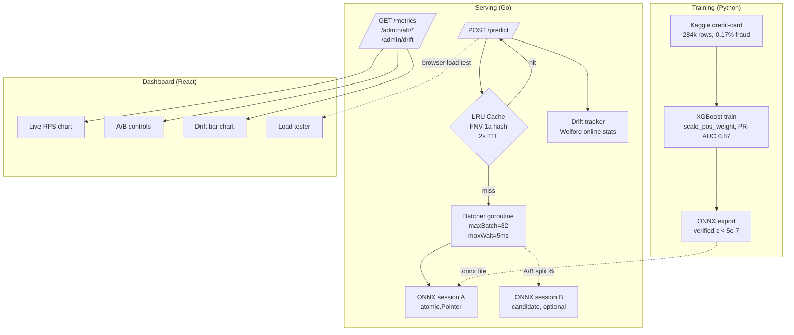

# Sentinel — Real-time fraud detection serving system

End-to-end ML serving system. Python trains an XGBoost fraud classifier
on 284k credit-card transactions; Go loads the exported ONNX model and
serves predictions over HTTP with batching, caching, A/B routing, drift
detection, and Prometheus metrics. A React dashboard ([repo](https://github.com/sameer-sde/sentinel-dashboard))
talks to the server in real time.

## Numbers

| Metric                         | Value                          |
|--------------------------------|--------------------------------|
| Training PR-AUC (winning model)| 0.87 (scale_pos_weight)        |
| Test set recall / precision    | 86% / 74% at threshold 0.41    |
| Optimal threshold (cost-based) | 0.41 vs default 0.5            |
| Python ↔ ONNX prediction diff  | < 5e-7 across 57k rows         |
| Cache hit rate on hot keys     | 99% (LRU, 10k capacity, 2s TTL)|
| Avg batch size (random load)   | 5.67x                          |
| **k6 cache-hot RPS**           | **71,483**                     |
| **k6 mixed traffic RPS**       | **53,636**                     |
| **k6 baseline (varied) RPS**   | **48,203**                     |
| **Latency p95 (mixed)**        | **5.46ms**                     |
| **Errors across 7.8M req**     | **0**                          |

Measured on M-series MacBook Air, single Go process. See [bench/RESULTS.md](bench/RESULTS.md).

## Architecture



## Layered design decisions

Each layer adds a specific capability with a measurable cost.

| Layer       | What it adds                              | Cost                       | Win                         |
|-------------|-------------------------------------------|----------------------------|-----------------------------|
| Baseline    | XGBoost train + evaluate                  | n/a                        | PR-AUC 0.84 floor           |
| Imbalance   | `scale_pos_weight` vs SMOTE compared      | +1 hyperparameter          | PR-AUC 0.87, recall +6%     |
| Threshold   | Cost-based optimization                   | +1 config file             | ₹650 saved per 57k rows     |
| ONNX        | Cross-language model serving              | +220KB on disk             | Drop Python from hot path   |
| Go HTTP     | Native serving                            | +3 endpoints               | p99 < 2ms warm              |
| Batching    | 1 goroutine owns session                  | +5ms wait window           | 5.67x avg batch size        |
| LRU cache   | FNV-1a hash + TTL                         | +1 mutex per access        | 99% hit, ~500x latency drop |
| Hot-swap    | `atomic.Pointer[modelBundle]`             | atomic load per batch      | Zero downtime deploys       |
| A/B split   | Two bundles, per-request routing          | cache bypass while live    | Real canary deployment      |
| Drift       | Welford running stats + z-score           | per-request observation    | Catch data drift in flight  |
| Metrics     | JSON + Prometheus exposition              | one histogram + counters   | Standard observability      |

## Quick start

### Requirements

- Python 3.11+ with pip
- Go 1.22+
- macOS or Linux (Mac instructions below)
- 1 GB free disk for ONNX runtime + dataset

### 1. Train the model

```bash
cd ml
python -m venv ../venv
source ../venv/bin/activate
pip install -r requirements.txt   # pandas, numpy, sklearn, xgboost, imbalanced-learn,
                                  # onnx, onnxmltools, onnxruntime, matplotlib
# Download Kaggle credit card fraud dataset to ../data/creditcard.csv first
python 00_explore.py
python 01_baseline.py
python 02_imbalance.py
python 03_threshold.py
python 04_export_onnx.py
```

Produces `models/fraud_model.onnx`, `models/threshold_config.json`, `models/improved.json`.

### 2. Install ONNX Runtime (native library)

```bash
cd onnxruntime
curl -L -O https://github.com/microsoft/onnxruntime/releases/download/v1.22.0/onnxruntime-osx-arm64-1.22.0.tgz
tar -xzf onnxruntime-osx-arm64-1.22.0.tgz
ln -sf "$(pwd)/onnxruntime-osx-arm64-1.22.0/lib/libonnxruntime.dylib" libonnxruntime.dylib
```

(Linux: use `onnxruntime-linux-x64-1.22.0.tgz`)

### 3. Arrange models with versioning

```bash
cd models
mkdir -p v1
mv fraud_model.onnx v1/
ln -s v1 current
```

### 4. Run the server

```bash
cd cmd/server
go build .
./server
```

Server listens on `:8080`.

### 5. Try it

```bash
curl -X POST http://localhost:8080/predict \
  -H 'Content-Type: application/json' \
  -d '{"features":[57007,-1.27,2.46,-2.85,2.32,-1.37,-0.95,-3.07,1.17,-2.27,
       -4.88,2.26,-4.69,0.65,-6.17,0.59,-4.85,-6.54,-3.12,1.72,0.56,0.65,
       0.08,-0.22,-0.52,0.22,0.76,0.63,0.25,0.01]}'
```

Returns:
```json
{
  "fraud_probability": 0.999861,
  "predicted_class": 1,
  "decision": "block",
  "threshold_used": 0.41,
  "latency_us": 177,
  "batch_size": 1,
  "cache_hit": false,
  "model_version": "v1",
  "variant": "A"
}
```

### 6. Dashboard

See [sentinel-dashboard](https://github.com/sameer-sde/sentinel-dashboard) for the React UI.
Run `npm install && npm run dev` and open `http://localhost:5173`.

## API

### Public
| Method | Path                  | Purpose                                    |
|--------|-----------------------|--------------------------------------------|
| POST   | `/predict`            | Run inference. Body: `{features: [...]}`   |
| GET    | `/health`             | Liveness check                             |
| GET    | `/metrics`            | JSON metrics                               |
| GET    | `/metrics/prom`       | Prometheus text exposition                 |

### Admin
| Method | Path                    | Body                              | Purpose                          |
|--------|-------------------------|-----------------------------------|----------------------------------|
| GET    | `/admin/version`        | -                                 | Current A (+ B if any)           |
| POST   | `/admin/reload`         | -                                 | Re-read `models/current` symlink |
| GET    | `/admin/drift`          | -                                 | Per-feature drift report         |
| POST   | `/admin/ab/setup`       | `{candidate_version: "v2"}`       | Load B from `models/v2/`         |
| POST   | `/admin/ab/split`       | `{percent: 25}`                   | Set traffic % to B               |
| POST   | `/admin/ab/promote`     | -                                 | Promote B to A, clear B          |
| POST   | `/admin/ab/abort`       | -                                 | Discard B, all traffic to A      |
| GET    | `/admin/ab/status`      | -                                 | A/B state + per-variant counts   |

## A/B test workflow
